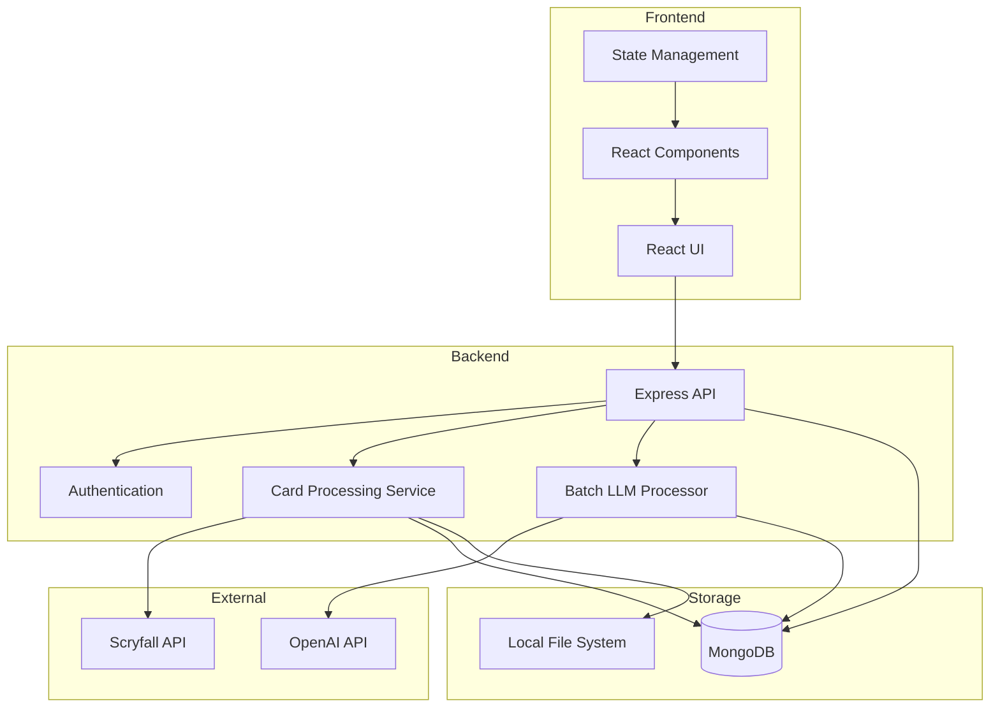
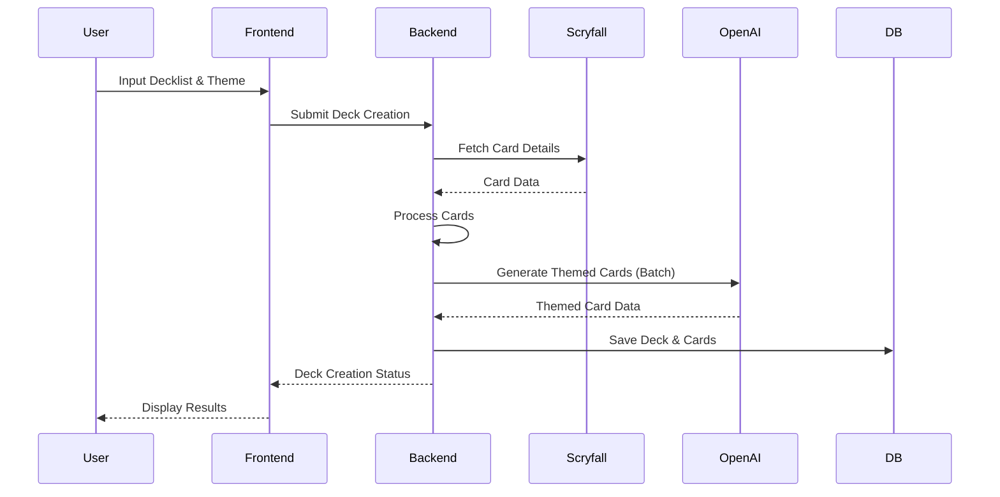
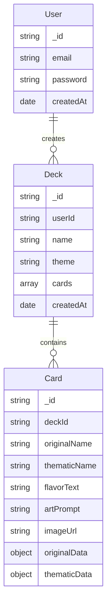

# MTG Proxy App System Architecture

## System Overview

## Data Flow

## Core Components

### Frontend Structure
- **UI Layer**: React components using modern UI library
- **State Management**: Context API for global state
- **Key Pages**:
  - Deck Creator
  - Deck Manager
  - Card Editor
  - User Dashboard

### Backend Services
- **API Layer**: Express with TypeScript
- **Authentication**: JWT-based auth
- **Card Processing Pipeline**:
  1. Decklist Validation
  2. Scryfall Data Fetching
  3. Batch LLM Processing
  4. Theme Application
  5. Storage Management

### Database Schema (MongoDB)

## API Endpoints

### Authentication
- POST /api/auth/register
- POST /api/auth/login
- GET /api/auth/profile

### Decks
- POST /api/decks
- GET /api/decks
- GET /api/decks/:id
- PUT /api/decks/:id
- DELETE /api/decks/:id

### Cards
- POST /api/cards/process-batch
- PUT /api/cards/:id/reroll
- GET /api/cards/:id
- PUT /api/cards/:id

## Processing Pipeline

1. **Deck Creation**:
   - Validate decklist format
   - Fetch card details from Scryfall
   - Queue for LLM processing

2. **Theme Application**:
   - Process cards in batches of 5-10
   - Generate thematic elements via OpenAI
   - Create art prompts

3. **Storage**:
   - Save card data to MongoDB
   - Store generated images locally
   - Link resources in database

## Security Considerations

1. Rate limiting for API endpoints
2. Secure storage of OpenAI API keys
3. Input validation and sanitization
4. CORS configuration
5. JWT token management

## Error Handling

1. API error responses
2. Retry logic for external services
3. Fallback options for failed operations
4. User-friendly error messages