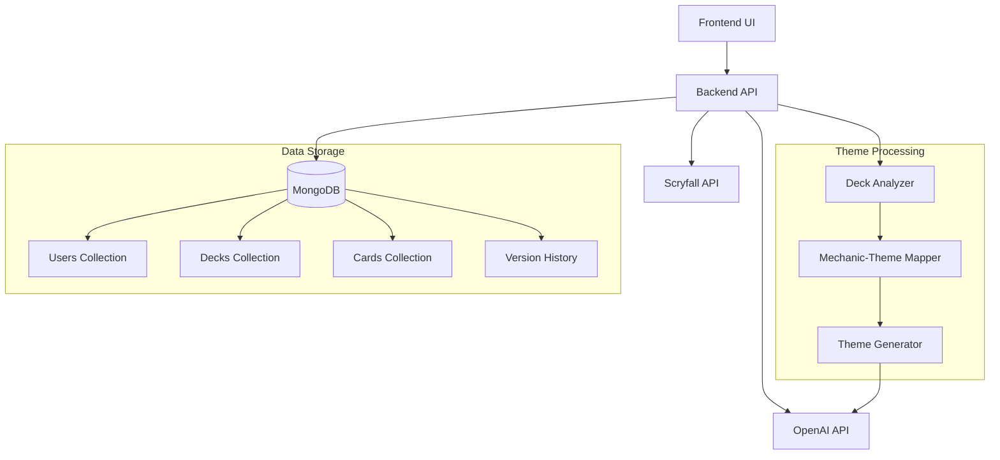

# Enhanced MTG Proxy App Architecture

## System Overview



## Data Models

### Deck Schema
```typescript
interface Deck {
  id: string;
  userId: string;
  name: string;
  description: string;
  isPublic: boolean;
  theme: {
    main: string;
    subthemes: {
      mechanic: string;
      thematicElement: string;
    }[];
  };
  cards: {
    cardId: string;
    quantity: number;
    currentVersionId: string;
  }[];
  created: Date;
  updated: Date;
}
```

### Card Version Schema
```typescript
interface CardVersion {
  id: string;
  cardId: string;
  deckId: string;
  originalCard: ScryfallCard;
  themedVersion: {
    name: string;
    flavorText: string;
    artPrompt: string;
    thematicNotes: string;
  };
  created: Date;
  mechanicCorrelation: {
    original: string[];
    themed: string[];
  };
}
```

## Key Components

### Deck Analyzer Service
- Analyzes deck composition and strategy
- Identifies key mechanics and synergies
- Provides input for theme correlation

### Mechanic-Theme Mapper
- Maps deck mechanics to thematic elements
- Maintains consistency across related cards
- Handles special cases (commanders, etc.)

### Version History System
- Tracks all card versions
- Enables rerolls with history
- Maintains theme consistency

### Public Deck System
- Manages deck visibility settings
- Provides browsing and search functionality
- Implements sharing mechanisms

## Implementation Priorities

1. Core Database Schema Implementation
2. Theme Processing Pipeline
3. User Authentication & Authorization
4. Card Generation & Version Control
5. Public Deck Management
6. UI Components & Integration

## Security Considerations

- User authentication and authorization
- Rate limiting for API requests
- Input validation and sanitization
- Secure storage of API keys and secrets