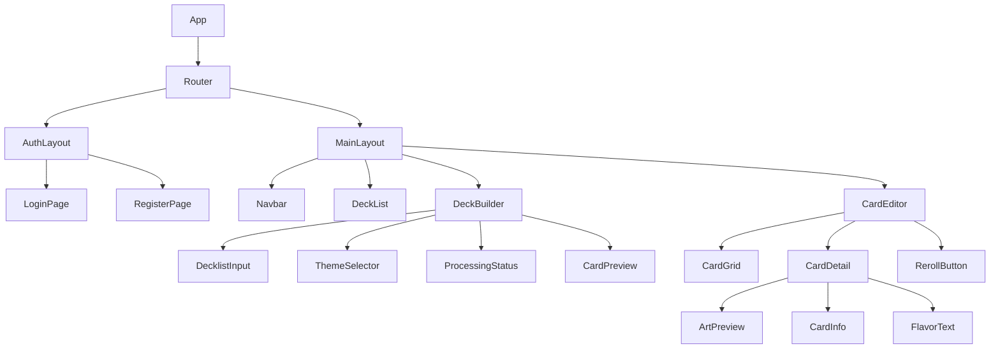

# Frontend Design Specification

## Component Hierarchy



## Page Wireframes

### 1. Deck Builder Page
```
+--------------------------------+
|          Navigation            |
+--------------------------------+
| +------------+ +--------------+|
| |  Decklist  | |    Theme     ||
| |   Input    | |  Selection   ||
| |            | |              ||
| |  [Paste]   | | [Theme Drop] ||
| |            | | [Specifics]  ||
| +------------+ +--------------+|
|                               |
| [Generate Proxies]            |
+--------------------------------+
```

### 2. Card Editor View
```
+--------------------------------+
|     Deck Name & Theme Info     |
+--------------------------------+
| +---------+ +---------+       |
| | Card 1  | | Card 2  |  ...  |
| +---------+ +---------+       |
|                               |
| Selected Card:                |
| +----------------------------+|
| |        Art Preview        ||
| |                          ||
| |                          ||
| +----------------------------+|
| Name: [Thematic Name]         |
| Flavor: [Flavor Text]         |
| Art Prompt: [View/Edit]       |
| [Reroll Card] [Save Changes]  |
+--------------------------------+
```

### 3. Deck Management
```
+--------------------------------+
|        Your Proxy Decks        |
+--------------------------------+
| +----------------------------+ |
| | Deck 1                    | |
| | Theme: Star Wars          | |
| | Cards: 100/100 Complete   | |
| +----------------------------+ |
|                                |
| +----------------------------+ |
| | Deck 2                    | |
| | Theme: LOTR               | |
| | Cards: 45/100 Processing  | |
| +----------------------------+ |
|                                |
| [New Deck] [Import]           |
+--------------------------------+
```

## Component Specifications

### DecklistInput
- Textarea with paste support
- Format validation
- Card count display
- Format helper/example
- Error highlighting

### ThemeSelector
```typescript
interface ThemeInput {
  themeName: string;
  setting?: string;
  specifics: {
    cardName: string;
    thematicReference: string;
  }[];
}

interface ThemeConfig {
  allowedTypes: string[];
  requiredFields: string[];
  examples: string[];
}
```

### CardPreview
- Loading states
- Error states
- Batch processing indicators
- Progress tracking

### CardEditor
- Grid/List toggle view
- Quick edit capabilities
- Reroll individual aspects
- Bulk operations

## State Management

```typescript
interface AppState {
  deck: {
    id: string;
    name: string;
    theme: ThemeInput;
    cards: Card[];
    status: 'processing' | 'complete' | 'error';
    progress: number;
  };
  
  ui: {
    currentView: 'list' | 'grid' | 'detail';
    selectedCard: string | null;
    filters: CardFilters;
    sortOrder: SortOptions;
  };
  
  processing: {
    batchStatus: BatchStatus[];
    errorLog: ProcessingError[];
    currentBatch: number;
    totalBatches: number;
  };
}
```

## User Interactions

1. **Deck Creation Flow**
   - Paste/Input decklist
   - Validate format
   - Select theme
   - Add specific card mappings
   - Initiate processing

2. **Card Customization**
   - Select card from grid
   - View current theme
   - Reroll specific aspects
   - Save changes
   - Bulk operations

3. **Theme Management**
   - Select predefined themes
   - Add card-specific mappings
   - View processing status
   - Export/Share deck

## Responsive Design

- Desktop-first approach
- Breakpoints:
  - Desktop: > 1024px
  - Tablet: 768px - 1024px
  - Mobile: < 768px

### Mobile Considerations
```css
/* Mobile adjustments */
.card-grid {
  grid-template-columns: 1fr;
  gap: 1rem;
}

.card-detail {
  position: fixed;
  bottom: 0;
  width: 100%;
  /* Slide up animation */
}
```

## Animation Specifications

1. **Card Processing**
   ```css
   .processing-indicator {
     animation: pulse 2s infinite;
   }
   ```

2. **Theme Application**
   ```css
   .theme-transition {
     transition: all 0.3s ease-in-out;
   }
   ```

3. **Card Reroll**
   ```css
   .reroll-animation {
     animation: flip 0.5s ease-in-out;
   }
   ```

## Accessibility

1. **Keyboard Navigation**
   - Full keyboard support
   - Focus management
   - Skip links

2. **Screen Readers**
   - ARIA labels
   - Role attributes
   - Status announcements

3. **Color Contrast**
   - WCAG 2.1 AA compliance
   - High contrast mode support

## Error Handling

1. **User Input**
   - Immediate validation
   - Clear error messages
   - Suggested corrections

2. **Processing Errors**
   - Retry options
   - Fallback views
   - Progress preservation

3. **Network Issues**
   - Offline support
   - Auto-retry
   - Progress recovery

## Performance Optimization

1. **Loading States**
   - Skeleton screens
   - Progressive loading
   - Lazy components

2. **Image Optimization**
   - Lazy loading
   - Responsive images
   - Format optimization

3. **State Management**
   - Selective updates
   - Batch operations
   - Cache management