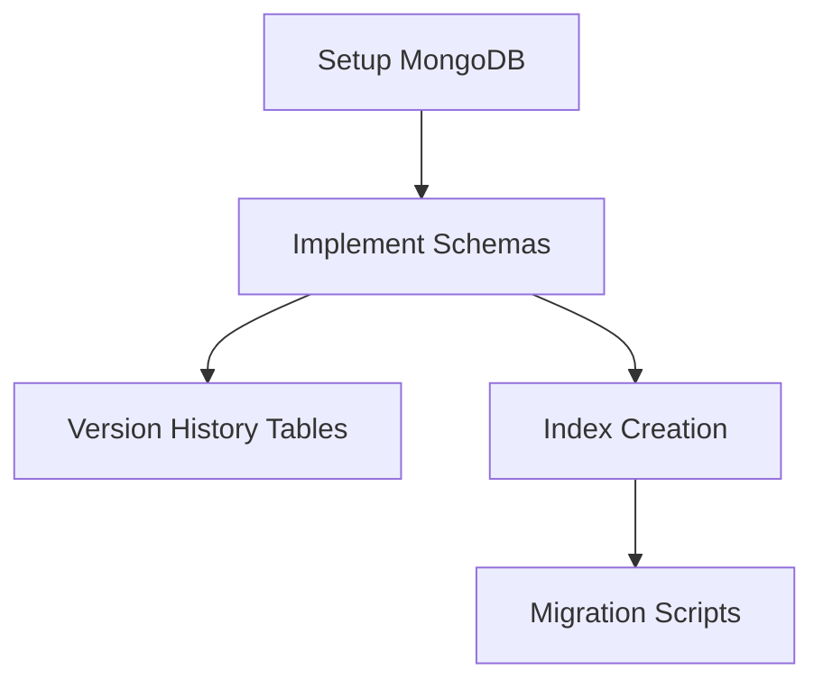
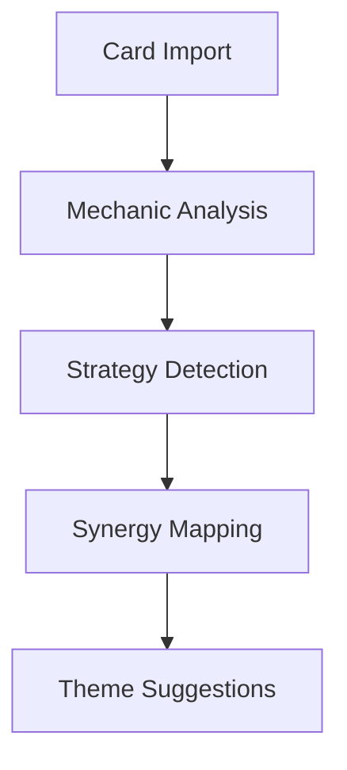
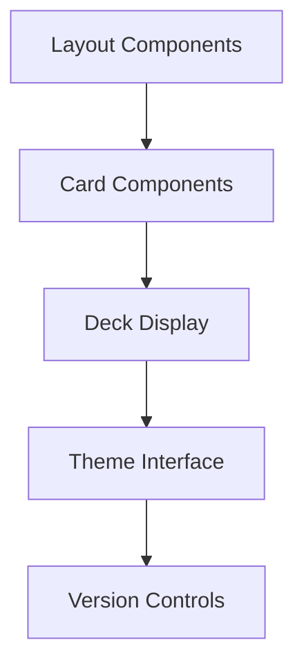
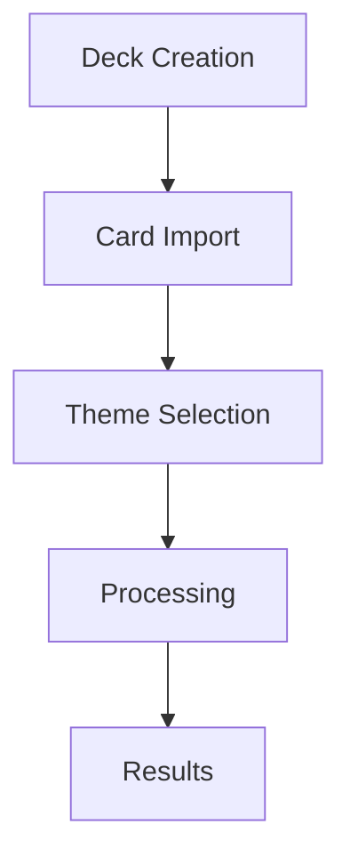
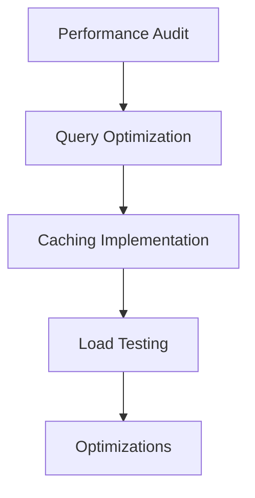
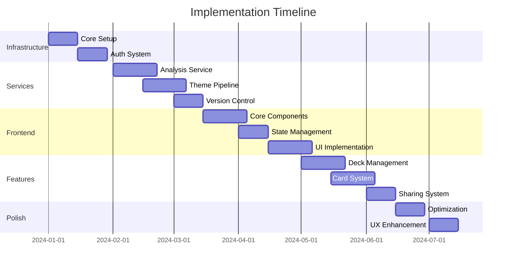

# Implementation Phases

## Phase 1: Core Infrastructure

### 1.1 Database & Schema Setup

- MongoDB configuration
- User schema
- Deck schema with privacy
- Card schema with versions
- Version history tracking
- Proper indexing for searches

### 1.2 Testing Infrastructure
- Jest configuration
- Testing utilities
- CI/CD pipeline
- Mock data generation
- Test database setup

### 1.3 Authentication System
- User registration
- Login/logout flow
- JWT implementation
- Permission system
- Password recovery

## Phase 2: Core Services

### 2.1 Deck Analysis Service

- Scryfall integration
- Deck parsing
- Mechanic identification
- Strategy analysis
- Synergy detection

### 2.2 Theme Generation Pipeline
- OpenAI integration
- Prompt engineering
- Response parsing
- Theme-mechanic mapping
- Consistency checking

### 2.3 Version Control System
- Version tracking
- Diff generation
- History management
- Reroll system
- Consistency maintenance

## Phase 3: Frontend Foundation

### 3.1 Core Components

- Layout system
- Navigation
- Card display
- Deck visualization
- Theme customization
- Version history UI

### 3.2 State Management
- Redux setup
- API integration
- Caching strategy
- Optimistic updates
- Error handling

### 3.3 User Interface
- Responsive design
- Theme system
- Loading states
- Error boundaries
- Accessibility

## Phase 4: Feature Implementation

### 4.1 Deck Management

- Deck creation flow
- Card import system
- Theme selection
- Processing pipeline
- Results display

### 4.2 Card Customization
- Card editor
- Theme adjustments
- Version management
- Reroll interface
- Preview system

### 4.3 Sharing System
- Privacy controls
- Public deck browser
- Search functionality
- Filtering system
- Social features

## Phase 5: Enhancement & Optimization

### 5.1 Performance

- Database optimization
- API performance
- Frontend optimization
- Image optimization
- Caching strategy

### 5.2 User Experience
- Animations
- Transitions
- Loading states
- Error handling
- Help system

### 5.3 Additional Features
- Batch processing
- Export options
- Templates system
- Advanced search
- Analytics

## Timeline & Dependencies

## Success Metrics

### Technical Metrics
- Test coverage > 80%
- API response < 200ms
- Frontend load < 2s
- Error rate < 1%

### User Metrics
- User retention
- Feature usage
- Error reports
- User feedback

## Risk Mitigation

### Technical Risks
1. API rate limits
2. Database performance
3. Image storage costs
4. Processing bottlenecks

### Mitigation Strategies
1. Queueing system
2. Caching layer
3. CDN integration
4. Batch processing

## Documentation Requirements

### Technical Documentation
- API documentation
- Component library
- Architecture guide
- Development setup

### User Documentation
- User guides
- Feature tutorials
- FAQs
- Troubleshooting

## Maintenance Plan

### Regular Tasks
- Dependency updates
- Security patches
- Performance monitoring
- Backup verification

### Long-term Tasks
- Code refactoring
- Feature deprecation
- Schema updates
- Infrastructure upgrades

This implementation plan provides a structured approach to building the MTG Proxy App, ensuring all components are properly developed and integrated while maintaining quality and performance standards.