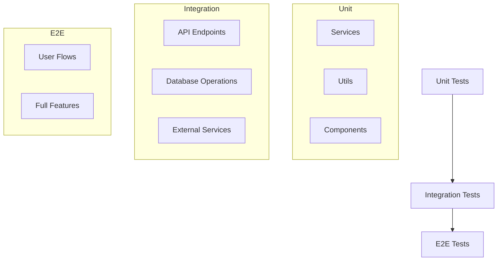
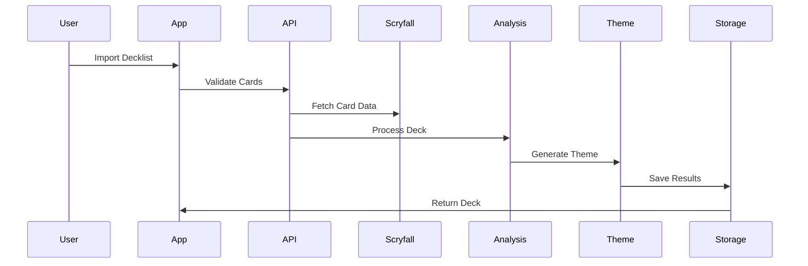

# Test Strategy

## Overview

This document outlines the testing approach for the MTG Proxy App, ensuring quality and reliability across all features.

## Test Levels



## 1. Unit Testing

### Core Services
- Deck Analysis Service
  - Mechanic identification
  - Synergy detection
  - Strategy classification

- Theme Generation Service
  - Prompt generation
  - Response parsing
  - Theme-mechanic correlation

- Version History Service
  - Version tracking
  - Diff generation
  - History retrieval

### Utility Functions
- Card data processing
- Deck validation
- Theme mapping utilities
- Version comparison tools

### React Components
- Card display components
- Theme customization interface
- Version history viewer
- Deck management components

## 2. Integration Testing

### API Integration
- Scryfall API interaction
- OpenAI API communication
- Error handling and rate limiting
- Response caching

### Database Operations
- CRUD operations for all models
- Version history management
- Query performance
- Index effectiveness

### External Service Integration
- Authentication flow
- File storage
- Image processing
- Batch operations

## 3. End-to-End Testing

### User Flows
1. Deck Creation Flow


2. Theme Customization Flow
3. Card Reroll Flow
4. Deck Sharing Flow

### Feature Testing
- Complete deck processing
- Theme generation pipeline
- Version history management
- Public deck browsing

## Testing Tools

1. Unit Testing
- Jest for JavaScript/TypeScript
- React Testing Library
- Jest Mock for service mocks

2. Integration Testing
- Supertest for API testing
- MongoDB Memory Server
- Mock Service Worker

3. E2E Testing
- Cypress
- Playwright

## Test Data Management

### Fixture Categories
```typescript
interface TestFixtures {
  decks: {
    basic: DeckFixture[];
    complex: DeckFixture[];
    edge: DeckFixture[];
  };
  themes: {
    simple: ThemeFixture[];
    complex: ThemeFixture[];
    invalid: ThemeFixture[];
  };
  cards: {
    standard: CardFixture[];
    special: CardFixture[];
    error: CardFixture[];
  };
}
```

### Mock Strategies
1. API Responses
2. Database States
3. User Sessions
4. External Services

## Performance Testing

### Areas of Focus
- Card processing pipeline
- Theme generation
- Database queries
- API response times

### Metrics
- Response times
- Memory usage
- Database performance
- API throughput

## Security Testing

1. Authentication
- Token validation
- Session management
- Permission checks

2. Data Access
- Private deck protection
- User data security
- API endpoint security

3. Input Validation
- Deck import validation
- Theme configuration
- API parameters

## Continuous Integration

### Pipeline Stages
1. Lint & Type Check
2. Unit Tests
3. Integration Tests
4. E2E Tests
5. Performance Tests
6. Security Scans

### Automation
- GitHub Actions workflow
- Automated deployments
- Test coverage reports
- Performance benchmarks

## Testing Guidelines

1. Test Organization
- Group by feature
- Clear naming convention
- Comprehensive coverage

2. Best Practices
- Isolated tests
- Meaningful assertions
- Clean setup/teardown
- Proper mocking

3. Documentation
- Test descriptions
- Setup requirements
- Expected outcomes
- Edge cases

## Implementation Priority

1. Core Infrastructure
- Unit test setup
- Integration test environment
- CI pipeline configuration

2. Feature Testing
- Critical path flows
- Core functionalities
- Edge cases

3. Performance & Security
- Load testing
- Security scanning
- Performance monitoring

This testing strategy ensures comprehensive coverage while maintaining practicality and efficiency in implementation.