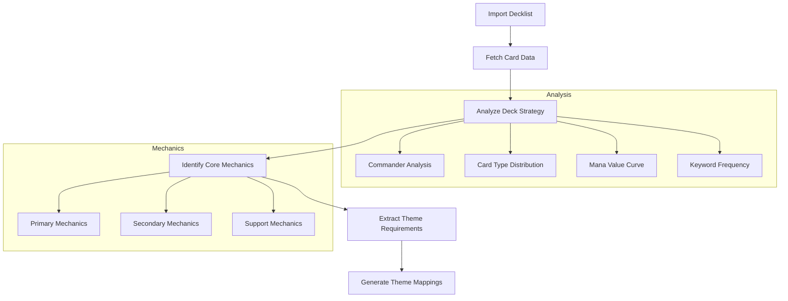

# Theme Correlation Strategy

## Overview
This document outlines the strategy for correlating MTG deck mechanics with thematic elements, ensuring flavor-mechanical alignment in the generated proxies.

## Deck Analysis Pipeline



## Theme-Mechanic Correlation

### 1. Strategy Classification
- Control
- Aggro
- Combo
- Midrange
- Value Engine
- Aristocrats
- etc.

### 2. Mechanical Elements Analysis
```typescript
interface MechanicalProfile {
  primaryMechanics: {
    mechanic: string;
    frequency: number;
    keyCards: string[];
  }[];
  supportMechanics: {
    mechanic: string;
    purpose: 'enabler' | 'payoff' | 'utility';
  }[];
  keywordFrequency: Record<string, number>;
  synergies: {
    cards: string[];
    description: string;
  }[];
}
```

### 3. Theme Mapping Guidelines

#### Commander-Based Mapping
- Analyze commander abilities and flavor
- Use as primary theme anchor
- Map similar abilities across universe

#### Mechanical Theme Translation
```typescript
interface ThemeMapping {
  mechanic: string;
  thematicElements: {
    concept: string;
    examples: string[];
    flavorGuidelines: string;
  }[];
}
```

Examples:
- Sacrifice → "betrayal", "sacrifice for power", "greater good"
- Tokens → "armies", "followers", "minions"
- Counters → "growth", "evolution", "corruption"

## OpenAI Prompt Strategy

### 1. Context Building
```typescript
interface PromptContext {
  deckStrategy: string;
  primaryMechanics: string[];
  flavorGuidelines: string[];
  universeRules: string[];
  consistencyAnchors: string[];
}
```

### 2. Card-Specific Prompting
```typescript
interface CardPrompt {
  originalCard: ScryfallCard;
  mechanicalRole: string;
  themeGuidelines: string[];
  existingCorrelations: {
    mechanic: string;
    themedVersion: string;
  }[];
}
```

### 3. Consistency Maintenance
- Track used names and concepts
- Maintain relationships between related cards
- Ensure mechanical representations align with universe rules

## Version History Management

### 1. Version Tracking
```typescript
interface VersionEntry {
  id: string;
  timestamp: Date;
  changes: {
    field: string;
    from: string;
    to: string;
    reason: string;
  }[];
  promptContext: PromptContext;
}
```

### 2. Reroll Strategy
- Maintain mechanical consistency
- Allow partial rerolls (name only, flavor only, etc.)
- Track theme evolution

## Implementation Phases

1. Core Analysis
   - Deck strategy identification
   - Mechanical profile generation
   - Synergy mapping

2. Theme Mapping
   - Universe rule definition
   - Mechanical correlation system
   - Consistency tracking

3. Generation Pipeline
   - Context building
   - Prompt engineering
   - Response validation

4. Version Control
   - History tracking
   - Reroll management
   - Consistency maintenance

5. UI Integration
   - Theme customization interface
   - Reroll controls
   - Version history display

## Testing Strategy

1. Mechanical Analysis
   - Test with various deck archetypes
   - Verify mechanic identification
   - Validate synergy detection

2. Theme Correlation
   - Test consistency across themes
   - Verify mechanical alignment
   - Check flavor coherence

3. Version Control
   - Test history tracking
   - Verify reroll functionality
   - Validate consistency maintenance